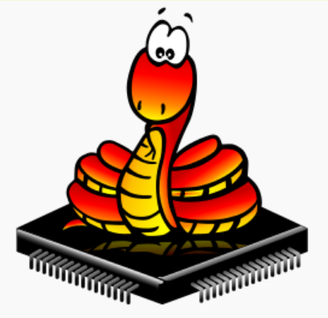

# MicroPython - WORK IN PROGRESS

2021-01-25

## Intro

[MicroPython]() is a Python interpreter running on a micro-controller.
To use it, first download the Python interpreter image for
your particular micro-controller onto the micro-controller.
The tool for doing so depends on your micro-controller.
If you don't screw up, you will have to do this only once.
Instructions for a few common ones can be found below.

To use the MicroPython interpreter on your micro-controller
you need a connection to it, usually a serial-over-USB connection.
For this MicroPython supports a protocol called REPL 
(Read-Execute-Print-Loop) that you can use directly, 
like you would use as a Python interpreter prompt.
But it is much easier to use a Python IDE that can connects
to the micro-controller.
I use
[Thonny](https://thonny.org)
for this purpose.
There are Thonny installers for Windows, Linux and Mac,
and even one that runs directly on a Python interpreter.

## EPS8266, ESP32, TTGO Watch

MicroPython for the ESP83266 and ESP32 is an easy way to
create an small WiFi-connected system.
The ESP8266 is the cheaper of the two, 
but its amount of RAM and FLASH is much smaller,
so I prefer the ESP32.

For both chips, the download tool is called esptool.
Use *the one from this 
[github](https://github.com/espressif/esptool)*,
others might not (always) work.

MicroPython images can be found at
[this page](https://micropython.org/download/all).

Before downloading, you must erase the Flash. 
The commands are:

```bash
# ESP8266, replace <PORT> (or omit --port <PORT>) and <IMAGE>
python esptool.py --chip esp8266 --port <PORT> erase_flash
python esptool.py --chip esp8266 --port <PORT> write_flash --flash_mode dio --flash_size detect 0x0 <IMAGE>
```

```bash
# ESP32, replace <PORT> (or omit --port <PORT>) and <IMAGE>
python esptool.py --chip esp32 --port <PORT> erase_flash
python esptool.py --chip esp32 --port <PORT> write_flash -z 0x1000 <IMAGE>
```

For all esptool target commands, you can either specify the
serialport with --port <PORT>, or leave this out and have the
esptool scan all your ports. 
For Linux: after an erase_flash the target re-connects, 
which on my system caused it to switch to a different */dev/ttyUSBx*.

For targets that have specific peripherals there are specialized
MicroPython images, with have some of the drivers for the
peripherals built-in. 
This is an image for the 
[Lilygo T-WATCH-2020](https://gitlab.com/mooond/t-watch2020-esp32-with-micropython)

The github repository you are reading now includes the
epstool, generic images for ESP8266 and ESP32, and 
a specific image for the T-WATCH-2020.
To flash one, assuming you are on Linux and in the root of
the cloned repository, you can use one of the commands:

```bash
make eps8266
make esp32
make ttgo_watch
```

For some reason this works on Linux, but it doesn't work reliably on windows, 
maybe because the USB-serial driver doesn't reset the target properly.

## Using Thonny
Connect your target that runs MicroPython via USB.
Start Thonny.
Under Run->Select interpreter you can select the Python
interpreter that you want your code to run on, and
(for MicroPython) the REPL connection port.
For me, *MicroPython (generic)* always worked.

In the bottom page, you see the REPL prompt. 
Here you can type MicroPython commands, 
and the output of MicroPython goes here.

You can edit Python code in the editor.
When you open or save a file, you will be asked whether
this must be done on *This computer* (your PC) or on the
*MicroPython device*.
When you run a file that is stored on your computer
on the MicroPython interpreter, it is automatically download
first, but note that any files you might import are not.

## Examples

### Hello

Hello world for MicroPython is exactly the same for normal Python.

```Python
print( "Hello world\n" )
```

### Blinky

Most boards have an on-board LED, but the pin to which the LED is 
connected depends on the board.

```Python
import machine, time
led = machine.Pin( 2, Pin.OUT )
while True:
  led.value( 1 )
  time.sleep( 0.5 )
  led.value( 0 )
  time.sleep( 0.5 )
```

### 

## Links
- [Thonny](https://thonny.org)
- [esptool](https://github.com/espressif/esptool)
- [a list of MicroPython libraries](https://awesome-micropython.com)
- [generic MicroPython images](https://micropython.org/download/all)       s
- [Lilygo T-WATCH-2020 image](https://gitlab.com/mooond/t-watch2020-esp32-with-micropython)

==> https://github.com/OPHoperHPO/lilygo-ttgo-twatch-2020-micropython
https://gitlab.com/mooond/t-watch2020-esp32-with-micropython
e.g. ESP-WROOM-32 should be DIO

interfaces:
https://github.com/OPHoperHPO/lilygo-ttgo-twatch-2020-micropython/blob/master/ports/esp32/boards/LILYGO_T_WATCH_2020_V1/modules/ttgo.py

## todo
- notes on support for hardware features
- more examples
- ttgo image
- test makefile
- note need to press key
- pyserial might be needed for esptool
- seems not to work on windows??
- find serial port does not work on linux :(
- watch picture
- Thonny picture


